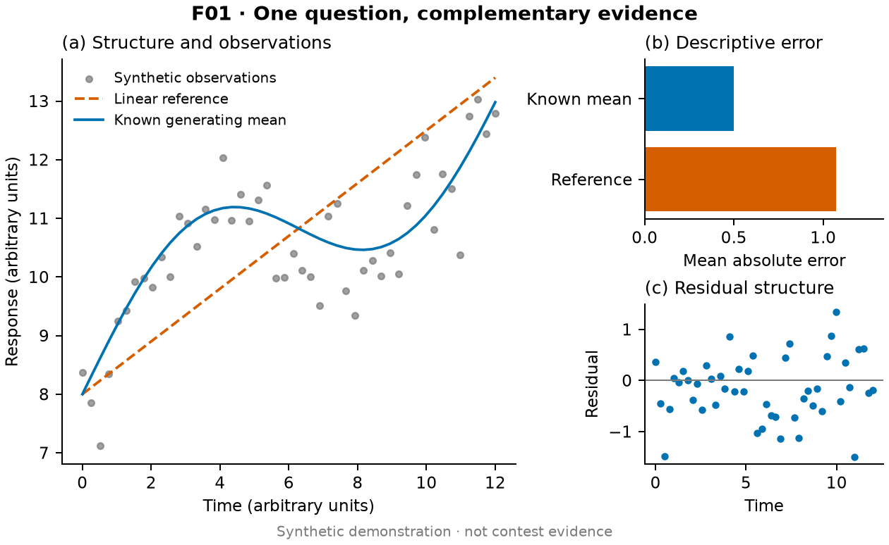
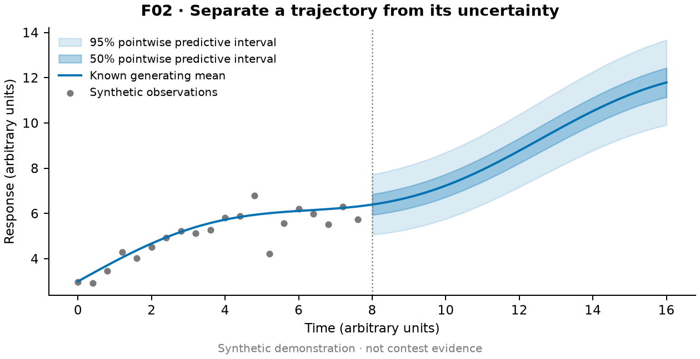
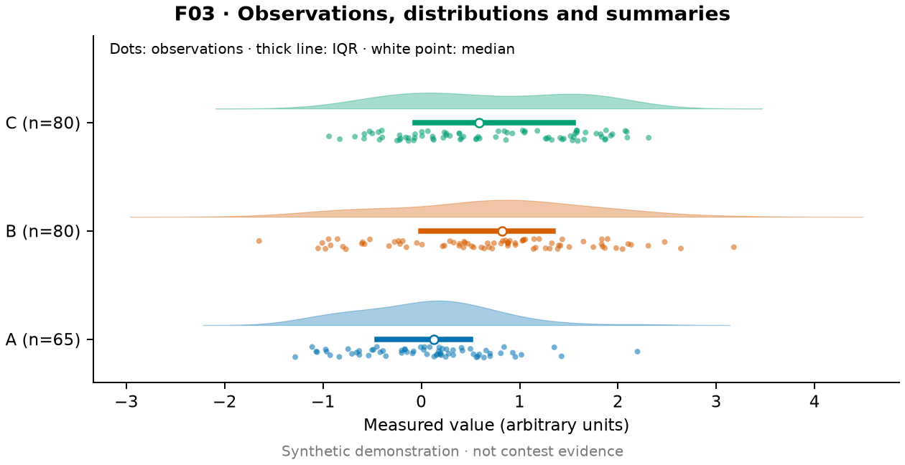
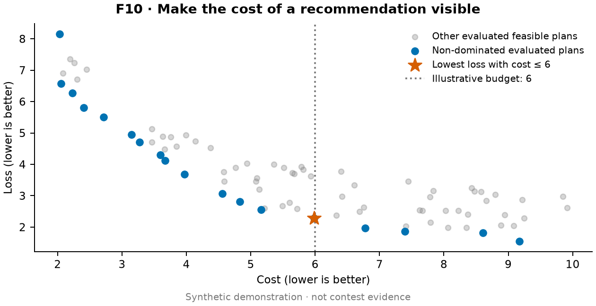
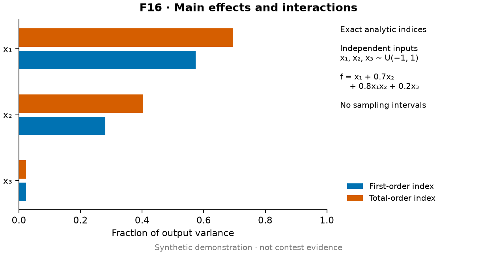
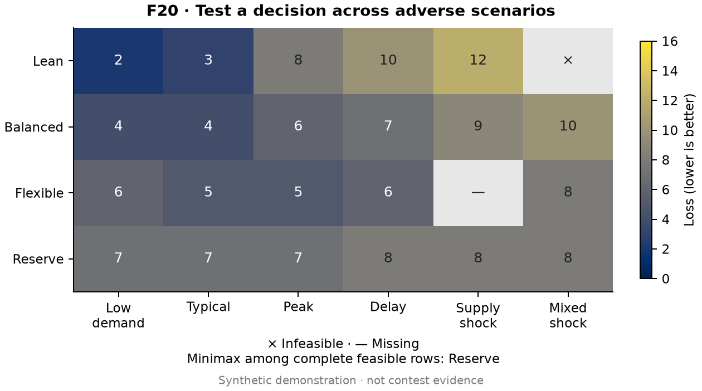

# Synthetic figure gallery / 合成数据效果样张

These are original, reproducible teaching examples, not contest results or copied
paper figures. Every preview carries a synthetic-data label. Quantities have
arbitrary units unless explicitly defined. Do not reuse these values in a paper.

The [20 preset cards](../references/presets.md) provide broader task-specific
prompts; these six examples demonstrate a subset. The [original demo script](../scripts/render_examples.py)
generates both PNG and vector PDF with NumPy and Matplotlib and never executes
the downloaded reference code.

## F01 · Evidence mosaic / 多面板



[Vector PDF](f01-mosaic.pdf). Forty-eight synthetic observations follow
`8 + 0.45t + 1.5 sin(t/2)` plus independent Normal(0, 0.6²) noise. The linear
reference is `8 + 0.45t`. Panels show the observations and known generating mean,
descriptive mean absolute errors, and residuals about that mean. Neither curve
was estimated from data; the error comparison is not held-out model validation.

## F02 · Predictive intervals / 预测区间



[Vector PDF](f02-forecast.pdf). The known mean is `3 + 0.5t + 0.8 sin(t/2)` with
independent Gaussian noise of standard deviation `0.4 + 0.035t`. After the
illustrative boundary t=8, bands show exact 50% and 95% pointwise predictive
intervals under that known model. They represent future observation noise,
exclude parameter uncertainty and do not provide simultaneous path coverage.
This is a design example, not a fitted empirical forecast.

## F03 · Raincloud / 雨云图



[Vector PDF](f03-raincloud.pdf). Independent synthetic groups contain 65, 80 and
80 observations. Group C is a two-component Gaussian mixture. Dots retain the
observations with vertical jitter; clouds use Gaussian KDE with bandwidth
`1.06 × sample_SD × n^(−1/5)` and a common density-height multiplier. Thick lines
show sample IQR and white points the median, not confidence intervals. Equal
cloud area represents normalized density, not equal group sample sizes.

## F10 · Pareto tradeoffs / Pareto 权衡



[Vector PDF](f10-pareto.pdf). Eighty synthetic feasible plans have cost drawn
uniformly from [2,10] and loss `13/cost + Uniform(0,1.8)`. Both objectives are
minimized. Blue marks are non-dominated among these evaluated points. The star
minimizes loss subject to an explicitly illustrative cost budget of 6. No claim
of a continuous global frontier or universal best plan is made.

## F16 · Global sensitivity / 全局敏感性



[Vector PDF](f16-sensitivity.pdf). For independent xi ~ Uniform(−1,1), the synthetic
model is `f = x1 + 0.7x2 + 0.8x1x2 + 0.2x3`. Exact variance components are
`V1=1/3`, `V2=0.49/3`, `V3=0.04/3`, `V12=0.64/9`; total variance is their sum.
First-order indices divide each main component by total variance; total-order
indices also include the interaction for x1 and x2. The plotted indices are
analytic, not estimated, so no confidence intervals are invented. Total-order
indices are not normalized to sum to one.

## F20 · Scenario robustness / 情景稳健性



[Vector PDF](f20-scenarios.pdf). The script defines a synthetic loss table for four
plans and six scenarios. All cells share the same loss scale; × is infeasible
and — is unobserved. Among rows feasible and observed in every scenario, Reserve
has the smallest maximum loss (8, versus Balanced's 10). Flexible cannot be
ranked by this complete-case minimax rule because one outcome is unknown. No
scenario probabilities are specified, so the figure reports no expected loss.

## Reproduce and inspect

From the repository root, using an environment with NumPy and Matplotlib:

```bash
python3 .claude/skills/mathodology-figure-presets/scripts/render_examples.py --output work/figure-examples --seed 20260907
python3 .claude/skills/mathodology-figure-presets/scripts/render_examples.py --self-test
```

The seed reproduces inputs. To refresh the committed gallery deliberately, set
`--output .claude/skills/mathodology-figure-presets/examples`. The script only
writes its twelve named PNG/PDF outputs and leaves this README intact.

Initial gallery rendered with Python 3.14, NumPy 2.5.3, Matplotlib 3.11.1 and the
bundled DejaVu Sans font. Figures are 7 inches wide (about 178 mm), use 9 pt base
text, and export PNG at 180 dpi for compact previews plus vector PDF. Production
exports can use 300 dpi or the actual contest specification. Rendering bytes may
vary by library/font version even when the source values match.

Check full-size PNGs and vector PDFs at their final paper width. The demo's
self-test checks numerical meanings and output formats; it does not certify
visual quality or exercise an image2 service. Adapt the code and prompts to the
actual data, units, inference and language rather than treating it as a fixed
plotting framework.
