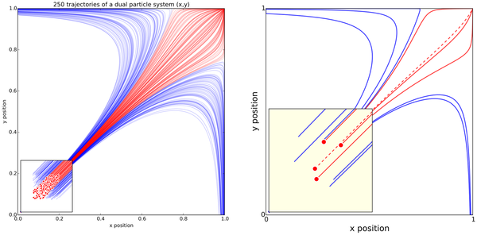
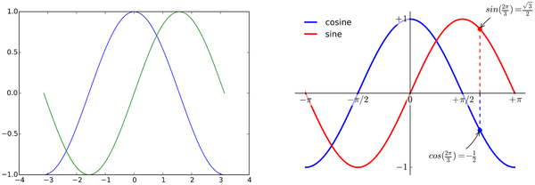
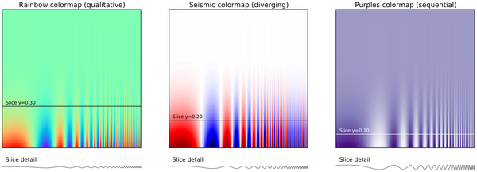
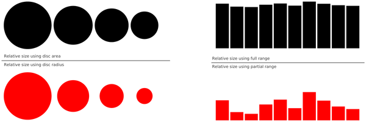
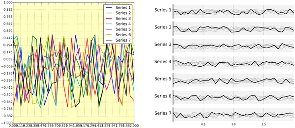
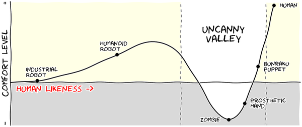

# Curated figure references / 图表参考素材

Use these as design references, never as results for the current modeling task.
Files are local, unchanged downloads; Python examples are stored as `.py.txt`
reference text and are not run automatically. Original prompts and synthetic
examples elsewhere in this skill are separate from these third-party works.

## Attribution and licenses

**P3–P8:** Nicolas P. Rougier, Michael Droettboom, Philip E. Bourne (2014),
*Ten Simple Rules for Better Figures*, PLOS Computational Biology 10(9): e1003833.
[Publisher article and license statement](https://journals.plos.org/ploscompbiol/article?id=10.1371/journal.pcbi.1003833).
The publisher identifies this work as CC0; these are unmodified publisher-served
medium-resolution PNG renditions of figures 3–8. They illustrate both successful
choices and deliberate counterexamples. Attribution is retained for provenance.
[CC0 dedication](https://creativecommons.org/publicdomain/zero/1.0/).

**M1–M8:** Matplotlib gallery source examples from tag v3.10.7, immutable commit
`4aeb773422464799998d900198b35cb80e94b3e1`. Copyright (c) 2012– Matplotlib
Development Team; All Rights Reserved. Earlier contributions retain their
original author notices. The complete upstream [license](matplotlib/LICENSE.txt)
is included. Files are byte-for-byte source snapshots with a `.txt` suffix;
no code changes were made. Read comments and dependencies before adaptation.
Do not apply this repository's MIT license to these third-party files.

## Paper figures: examples and counterexamples

| Reference | Preview | What to inspect |
|---|---|---|
| P3 · Figure 3 |  | Paper/detail versus presentation/simplification; preserve the reading hierarchy. |
| P4 · Figure 4 |  | Compare defaults with deliberately selected visual settings; do not copy the bad design. |
| P5 · Figure 5 |  | Compare color maps on the same signal; some color choices hide variation. |
| P6 · Figure 6 |  | Counterexamples: radius versus area, and misleading axis truncation. |
| P7 · Figure 7 |  | Overplotted lines versus separated small multiples. |
| P8 · Figure 8 |  | Explicitly hypothetical illustration; sketch styling is not a template for measured results. |

## Official code references

| ID | Local reference | Useful for |
|---|---|---|
| M1 | [scatter_hist.py.txt](matplotlib/scatter_hist.py.txt) | F07: joint axes and marginal distributions |
| M2 | [confidence_ellipse.py.txt](matplotlib/confidence_ellipse.py.txt) | F07: ellipse construction; distinguish covariance spread from confidence in the mean |
| M3 | [fill_between_demo.py.txt](matplotlib/fill_between_demo.py.txt) | F02: filled intervals from supplied bounds |
| M4 | [violinplot.py.txt](matplotlib/violinplot.py.txt) | F03/F04: distribution geometry, not inferential intervals |
| M5 | [contourf_demo.py.txt](matplotlib/contourf_demo.py.txt) | F09: contours and masked grids |
| M6 | [image_annotated_heatmap.py.txt](matplotlib/image_annotated_heatmap.py.txt) | F08/F20: labeled heatmaps and color scales |
| M7 | [sankey_basics.py.txt](matplotlib/sankey_basics.py.txt) | F12: flow widths and connections |
| M8 | [inset_locator_demo2.py.txt](matplotlib/inset_locator_demo2.py.txt) | F14: inset axes and connectors |

## Acquisition and verification

[sources.tsv](sources.tsv) records each local path, original download URL,
attribution, license, version, UTC access date, byte count and SHA-256. This
manifest includes the upstream license itself. The original assets remain
readable offline; retained snapshots do not require external access at run time.
Hashes identify the fetched bytes, not the correctness of their scientific use.

Discovery used built-in web search and the search MCP's paper category. The PLOS
publisher page confirmed title, authors, figure numbers and CC0. paper_graph
returned the cited work and its citation neighborhood; this is not a guarantee
of complete correction/retraction coverage. One underlying search engine reported
a CAPTCHA limitation; publisher access and the accepted resources succeeded.
Matplotlib's primary repository confirmed the revision and license.

The collection is deliberately small: six paper figures and eight official code
references, plus the license. No article text or dataset archive is vendored.
To refresh a file, use its recorded URL, check the license again, validate its
actual format, and update the version/date/hash together. An unavailable or
changed upstream must be reported; do not replace it with an unrelated image.
