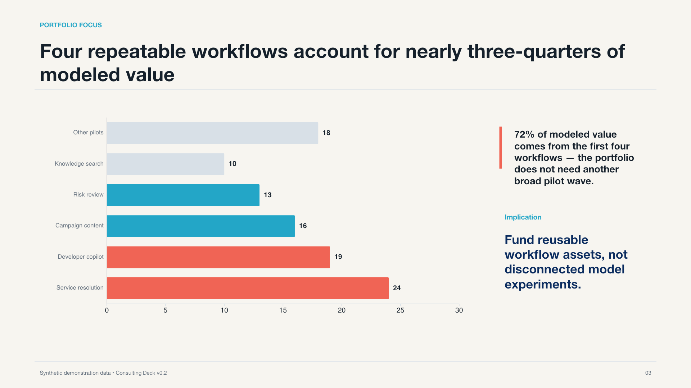
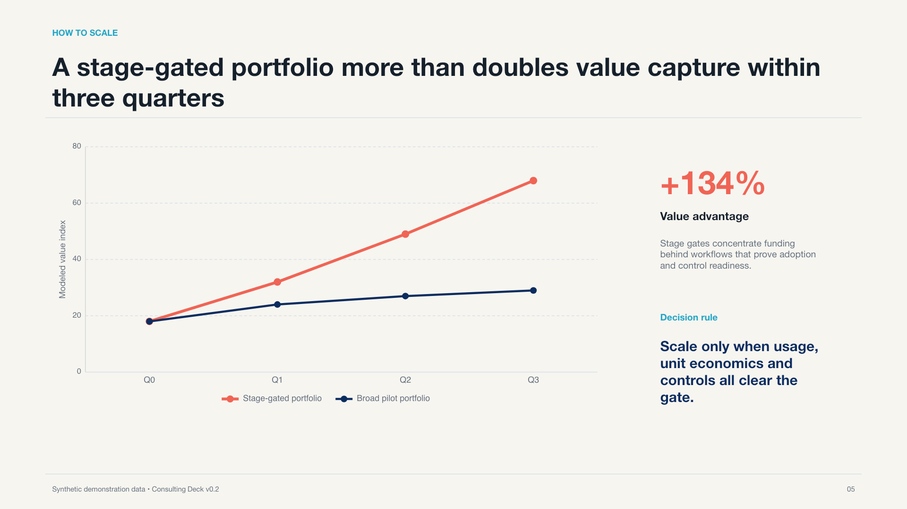
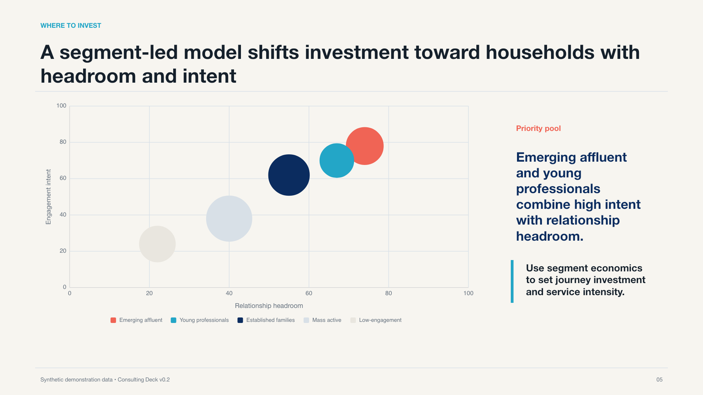
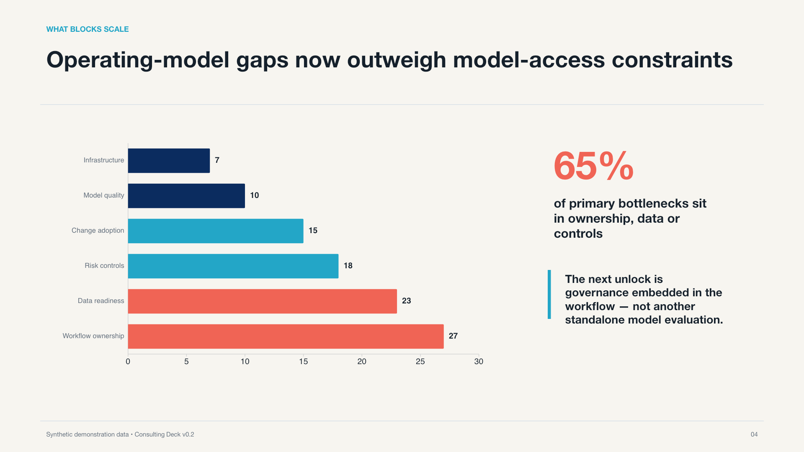
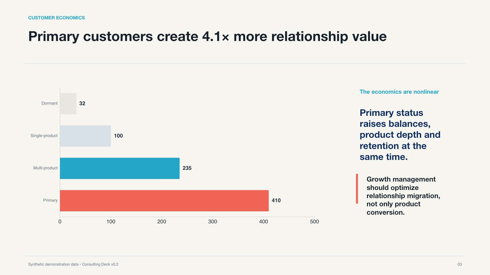
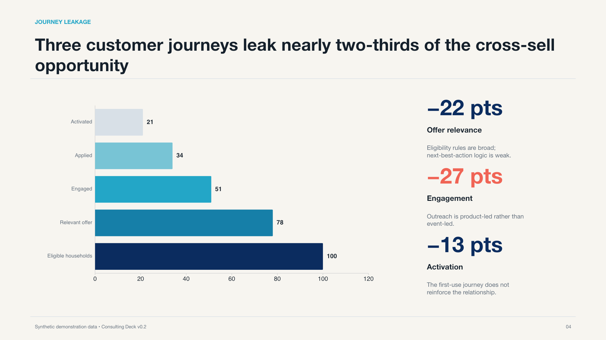

<div align="center">

# Consulting Deck

### Turn complex source material into management-ready, McKinsey-style PowerPoint

Answer-first storyline · Analytical charts · Traceable evidence · Native editability · Slide-by-slide QA

[简体中文](README.zh-CN.md) · [Download a real demo](#real-output-not-a-concept-image) · [See the workflow](#the-full-workflow) · [Project website](https://www.zhizhuzairui.com/works/consulting-deck)

</div>

<p align="center">
  <a href="examples/ai-value-realization/ai-value-realization-demo.pptx?raw=1">
    
  </a>
</p>

<p align="center"><sub>Actual output. Click the image to download the natively editable PPTX. All example data is synthetic.</sub></p>

> Consulting style is not white space, dark-blue headings, and thin rules. A useful consulting deck gives every slide a conclusion, every chart a question to answer, and every material number a source.

Consulting Deck is an Agent Skill for creating, revising, and auditing McKinsey-style consulting presentations. It establishes the audience, decision, evidence, and storyline before choosing charts and layouts, then produces a `.pptx` that people can continue editing instead of a collection of slide-shaped images.

## At a glance

| | Consulting Deck |
|---|---|
| Input | PDF, Word, Markdown, spreadsheets, CSV, web pages, a research topic, or an existing PPTX |
| Analysis | Evidence Ledger, pyramid structure, SCQA, answer-first titles, and chart specifications |
| Production | Native PowerPoint text, charts, tables, shapes, and speaker notes |
| Revision | Preserve project sources and rebuild only affected slides |
| QA | Evidence, logic, data, editability, and slide-by-slide rendering checks |
| Delivery | Editable `.pptx`, reusable project workspace, and delivery notes |

## v0.3: charts that are checked, not just generated

| New capability | Why it matters |
|---|---|
| 8 analytical page types and 6 native chart components | Trends, rankings, comparisons, composition, surveys, paired exhibits, and small multiples follow explicit data and layout rules |
| Data checks against the exported PPTX | Compare category order, series names, values, and embedded Excel data with project sources; mismatches block delivery |
| One source for reusable copy | Store titles and key explanations centrally, so changing a layout does not create conflicting versions of the argument |
| Try difficult slides before committing | Select feasible layouts from chart counts, data volume, and copy length, then render a small set of real alternatives without shrinking text to make it fit |
| Fresh checks after revisions | Changed source data or PPTX files invalidate old check records and require another review |

These features apply to the supported native-component pages. Other slides use the host Agent's presentation tools and QA workflow. See the [native chart component guide](references/native-exhibits.md) for the contract and usage.

## Start in 30 seconds

Review the repository and its security boundary, then copy or link it into the Skill directory used by your Agent host:

```bash
git clone https://github.com/zairuilab/consulting-deck.git
```

Common locations:

```text
~/.agents/skills/consulting-deck
~/.codex/skills/consulting-deck
~/.claude/skills/consulting-deck
```

Then provide the material and the job:

```text
Use Consulting Deck to turn this industry report into a 12-slide,
reading-first, McKinsey-style consulting presentation.
Establish the governing thought first, then rebuild the charts that affect the decision.
Keep material charts natively editable and cite the source and page in notes.
Render every slide and fix overflow, collisions, wrapping, and compatibility issues.
```

## Real output, not a concept image

<table>
  <tr>
    <td width="50%">
      <a href="examples/ai-value-realization/ai-value-realization-demo.pptx?raw=1">
        
      </a>
    </td>
    <td width="50%">
      <a href="examples/retail-banking-growth/retail-banking-growth-demo.pptx?raw=1">
        
      </a>
    </td>
  </tr>
  <tr>
    <td valign="top">
      <strong>AI Value Realization</strong><br>
      Builds an evidence chain around a governing thought: AI value is concentrated, not evenly distributed. The deck connects portfolio choices, scale barriers, and a 90-day action agenda.<br><br>
      <a href="examples/ai-value-realization/ai-value-realization-demo.pptx?raw=1">Download editable PPTX</a> ·
      <a href="examples/ai-value-realization/montage.png">See all 6 slides</a>
    </td>
    <td valign="top">
      <strong>Retail Banking Growth</strong><br>
      Shows why primary relationships explain growth better than acquisition volume alone, moving from customer economics to journey leakage, segment priorities, and focused growth moves.<br><br>
      <a href="examples/retail-banking-growth/retail-banking-growth-demo.pptx?raw=1">Download editable PPTX</a> ·
      <a href="examples/retail-banking-growth/montage.png">See all 6 slides</a>
    </td>
  </tr>
</table>

Both examples use synthetic data and are not real-world benchmarks or forecasts. The repository includes the final PPTX, slide renders, full-deck previews, and reproducible generation source.

| Verified item | AI example | Banking example |
|---|---:|---:|
| Slides | 6 | 6 |
| Native PowerPoint charts | 4 | 4 |
| Slides with speaker notes | 6 | 6 |
| Full-slide screenshots | 0 | 0 |
| Structure and overflow checks | Passed | Passed |

[Read the machine-readable QA record](examples/qa-summary.json)

### Chart gallery

These are actual slides from the public demos, not concept images. Click a slide to download its PPTX and inspect the editable chart and text objects.

<table>
  <tr>
    <td width="50%"><a href="examples/ai-value-realization/ai-value-realization-demo.pptx?raw=1"></a></td>
    <td width="50%"><a href="examples/ai-value-realization/ai-value-realization-demo.pptx?raw=1"></a></td>
  </tr>
  <tr>
    <td width="50%"><a href="examples/retail-banking-growth/retail-banking-growth-demo.pptx?raw=1"></a></td>
    <td width="50%"><a href="examples/retail-banking-growth/retail-banking-growth-demo.pptx?raw=1"></a></td>
  </tr>
</table>

The public demos preserve the previously accepted design. The v0.3 components were separately regression-tested using banking and AI research data; user-provided reports and private acceptance files are not included in this repository.

[See the v0.3 verification scope: 24 tests, 14 slides, 19 native charts](examples/v0.3-verification.json)

## How it differs from a typical AI slide tool

| | Typical AI slide tool | Consulting Deck |
|---|---|---|
| Starting point | A topic and a page template | The audience, decision, and available evidence |
| Titles | Describe what the slide covers | State the conclusion the reader should take away |
| Charts | Pick a style, then insert data | Define the analytical question, then choose and annotate the chart |
| Evidence | Sources are easily lost | Material claims retain their source, page, and evidence type |
| Delivery | Images, HTML, or hard-to-edit slides | Text, charts, tables, and simple frameworks remain native whenever practical |
| Revision | Regenerate the whole deck | Change the project source and rebuild only affected slides |
| QA | Stop when the file opens | Render every slide and inspect logic, data, layout, and compatibility |

## Six core mechanisms

### 1. Build the argument before drawing slides

Establish the governing thought first, then give every slide one communication job. Check the horizontal logic across the deck and the vertical “conclusion–evidence–implication” logic within each slide.

### 2. Use charts as the analytical language

Select charts from the business question: comparison, trend, composition, change, distribution, or relationship. Every material exhibit receives a separate specification covering its data, takeaway, annotations, and source before PowerPoint production begins.

The chart system draws on public consulting research and the visual vocabulary of McKinsey's open-source [Vizro](https://github.com/mckinsey/vizro) project. The delivery standard remains clear, restrained, and natively editable.

### 3. Trace material claims back to the source

Keep facts, calculations, source interpretations, and hypotheses separate. Material claims point back to a source file, page, or data table instead of leaving a polished slide with an untraceable number.

### 4. Deliver a PPTX people can continue editing

Text stays text. Tables stay tables. Common charts use native PowerPoint charts whenever practical. Matrices, processes, and timelines use editable shapes where possible. Users can change a title, update data, or replace a color without rebuilding a flattened screenshot.

### 5. Preserve a reusable project workspace

Evidence, hypotheses, storyline, chart data, slide blueprints, and review records remain in the project workspace. A slide revision changes the owning source, regenerates affected pages, and rechecks the full deck.

### 6. Inspect every slide before delivery

File generation is not the finish line. Check sources, answer-first titles, chart intent, object editability, typography, and layout. Render every slide to catch overflow, collisions, incorrect wrapping, and compatibility problems.

## The full workflow

```text
Define the audience, decision, and page count
  → Organize evidence and, when needed, falsifiable hypotheses
  → Build the storyline and answer-first titles
  → Specify the data, annotations, and sources for material charts
  → Choose the visual direction and slide blueprint
  → Produce a natively editable PPTX through the appropriate runtime
  → Render every slide and review the deck as a whole
  → Deliver the file with any remaining uncertainties
```

The saved workspace keeps the project source explicit:

```text
brief.json          Audience, decision, page count, and delivery constraints
evidence.json       Sources, pages, facts, calculations, and hypotheses
storyline.json      Governing thought and slide sequence
charts.json         Chart questions, data, annotations, and sources
slides.json         Slide blueprints and object specifications
content.json        Optional shared titles and key explanations
design-system.json  Type, color, grid, and density rules
qa/                 Structural checks, rendered review, and delivery records
```

## Three presentation directions

| Direction | Best for | Character |
|---|---|---|
| Research Analytical | Industry research, white papers, and formal business reviews | Evidence-dense, chart-led, and footnoted |
| Executive Story | Management decisions, strategy proposals, and client work | Tighter conclusions and decision-led sequencing |
| Editorial Keynote | Talks, launches, and point-of-view presentations | Fewer slides with stronger pacing and visual tension |

Each direction can use reading-first or speaker-led density. Users can also apply their own brand system or a legally held PPTX template.

## Supported jobs

- Create a new deck from PDF, Word, Markdown, spreadsheets, CSV, web pages, or a research topic.
- Revise selected slides from the saved project workspace and recheck affected content.
- Apply a user-owned brand system or licensed PPTX template.
- Audit an existing presentation without changing it, covering storyline, evidence, charts, editability, layout, and rendered quality.

## PowerPoint runtimes

Consulting Deck separates consulting intelligence from PPTX production. The Skill owns evidence, storyline, chart specifications, slide blueprints, and quality standards; a runtime turns those sources into PowerPoint objects.

Use the host Agent's native presentation capability by default. When deeper slide-master, native-template-fill, or DrawingML support is required, an independently audited PPT Master installation can be used as an optional runtime adapter. It is not bundled, and it cannot rewrite approved evidence or storyline. See [`references/runtime-adapters.md`](references/runtime-adapters.md) for the selection and safety boundary.

### Verified environment and limits

| Part | Requirements and verification scope |
|---|---|
| Data compilation, layout queries, and PPTX data checks | Python 3.10+ with the standard library only; the checker is independent of the PPTX generator |
| New native chart components | Require Artifact Tool supplied by the host; generation, embedded workbooks, re-import, and slide-by-slide rendering have been tested |
| Other PPTX tools | Can be adapted, but need separate integration and testing; direct compatibility with the new components is not claimed |
| PowerPoint / WPS | Native objects are retained; manual editing in Office or WPS was not tested in this round |

This is not an online slide editor or a standalone app that produces a finished deck in every Agent host with one command. Data checks do not replace source review, analytical judgment, or visual inspection.

Run the local regression tests:

```bash
python3 -B -m unittest discover -s tests -p 'test_*.py'
node --test tests/test_native_exhibits.mjs
```

## Brand boundary

The default output uses a McKinsey-style consulting visual language while keeping the brand layer neutral. It does not place the “智珠在睿” identity in user decks. The Peng preset is enabled only when explicitly selected. Other users can apply their own logo, type, colors, or PPTX template without changing the core Skill.

Consulting Deck was created by **Peng · 智珠在睿**.

## Independent project

Consulting Deck is an independent open-source project. It is not affiliated with or endorsed by McKinsey & Company, BCG, Bain, or any other consultancy. It learns from analytical communication methods visible in public consulting research; it does not copy consultancy logos, proprietary templates, or protected brand assets.

## Security and license

Consulting Deck does not automatically download dependencies, search the web, or install third-party runtimes. The included scripts operate only on local project files and PPTX packages. They contain no telemetry, credential collection, persistence hooks, or automatic network calls. See [SECURITY.md](SECURITY.md) for the runtime boundaries.

Apache License 2.0. See [LICENSE](LICENSE).
